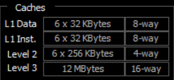
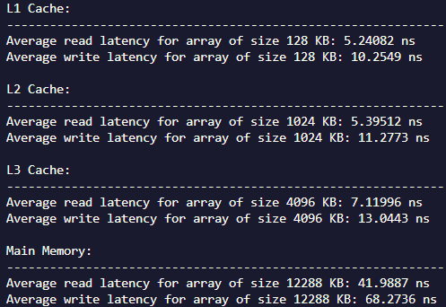
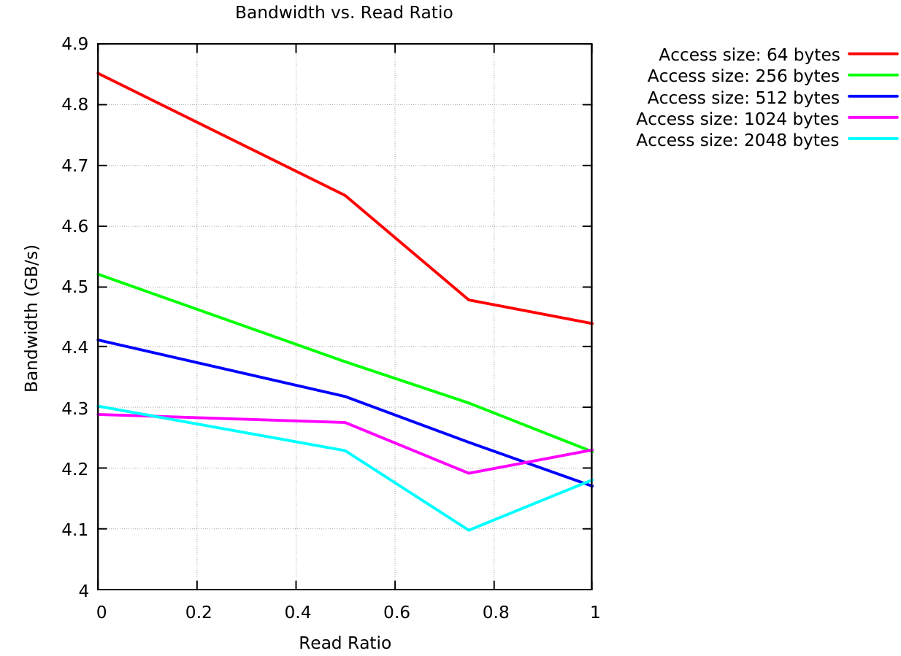
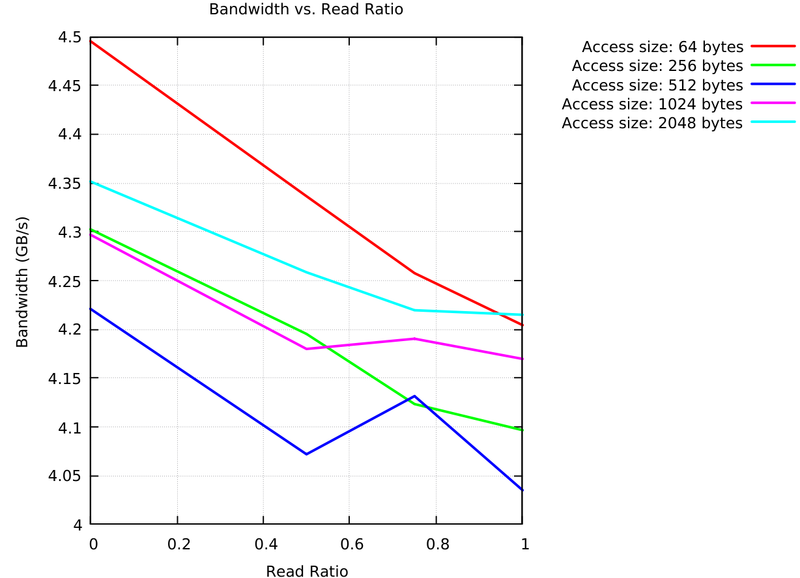
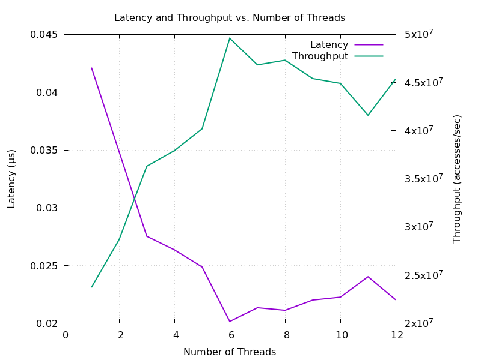
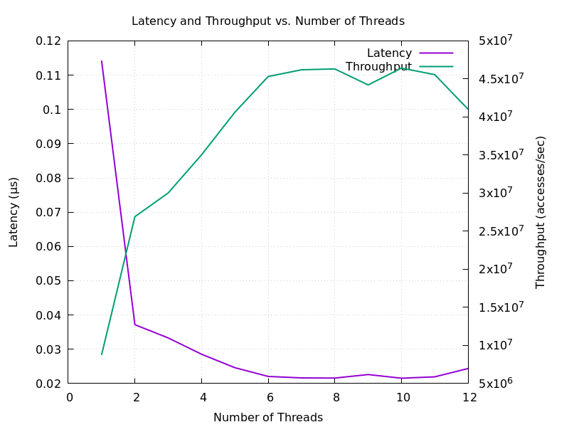
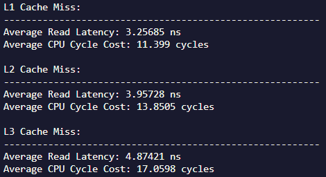
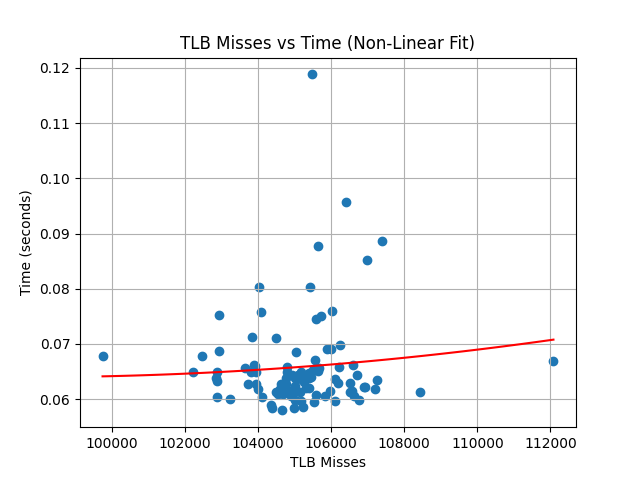

# Cache Profiling

## Overview
This page discusses my research into the memory system of my laptop. It reveals optimal programming practices, hardware architecture, and system performance. All experiments described here can be replicated by sourcing the `script.sh` file or running the individual commands outlined in the script.

## System Research
Using the `hwloc` Linux tool, I can reveal the cache structure shown below:

  

From this, we can see that each core in my computer has its own L1 and L2 caches. Further information, such as cache associativity, can be gathered by running the command: `getconf -a | grep CACHE`.

  

We can also use CPU-Z to confirm this on the Windows side.

  

## Experiment #1: Read/Write Latency with Queue Length = 0

### Requirements
This experiment will:
1. Test the latency of L1, L2, L3 caches, and main memory.
2. Ensure the queue length is close to 0 by minimizing resource conflicts.
3. Perform and time simple read/write operations.
4. Scale outputs to latency, i.e., in terms of a single operation.

### Explanation
We use C++ to force the allocation of data into each level of memory by adjusting the data size to match the capacity of each cache level. For example, a vector larger than the L1 cache (6 * 32 KB) will overflow into the L2 cache, allowing us to measure L2 latency. The assumption is that the FIFO cache structure will retain the data for testing.

This method is not ideal, as there is no easy way to directly manage memory in the cache. However, as the results show, we can still observe the varied caching latencies resulting from different allocation levels.

### Results
As expected, we see an increase in latency across both reads and writes for each layer of cache/memory traversed.

  

## Experiment #2: Memory Bandwidth Across Varied Data Granularity

### Requirements
This experiment will:
1. Test 64, 256, 512, 1024, and 2048 KB accesses across varied read/write percentages.
2. Test main memory bandwidth (DDR4)
3. Utilize all 12 threads across 6 SMT cores (optimal in an ideal world).

### Explanation
This experiment aims to show the maximum bandwidth of my DDR4 memory, which should operate somewhere between 4-8 GB/s. It allocates a 1 GB vector and performs various percentages of reads/writes, times the results, and outputs the results to a graph.

Additionally, another item of interest is the data access size. I found that the ideal size is 64 B, which makes sense as this is the cache line size for my system. As the CPU will first check the cache for the data, a size of 64 B would be ideal, as that is exactly equivalent to one cache line. Below are graphs from two separate runs. They show that while 64 B is obviously the ideal case, the speed of the others is inconsistent. This trend was observed across many runs, but only two are shown below.

### Results

   

## Experiment #3: Tradeoff Between Latency and Throughput with Respect to Queuing Theory

### Requirements
This experiment will:
1. Show that multithreading increases throughput up to a point.
2. Prove that queuing decreases throughput and increases latency.

### Explanation
In cache, queuing theory states that eventually, system blockage can occur if the cache becomes overutilized. Therefore, I designed a C++ experiment to flood the cache using large arrays and multithreading.

Though my CPU is capable of 12 threads, this experiment shows that the cache does not operate ideally when all 12 threads are using it. This causes blockage and misses, negatively affecting performance and latency. This can be observed for both reads and writes below.

### Results

  Read Latency:

   

  Write Latency:

  

## Experiment #4: Impact of Cache Miss on Speed

### Requirements
This experiment will:
1. Show that cache misses slow down program execution.
2. "Flush" lower caches to ensure data is only available on the target cache.
3. Approximate CPU cycle and latency costs for L1, L2, and L3 cache misses.

### Explanation
This program attempts to force a cache miss by allocating an array on the target cache and then flooding all lower cache levels with other data. The time taken to read back the target array will be used to calculate the cost of the miss and latency.

It is important to note that we estimate cycles and latency using a fixed CPU cycle time. In reality, the CPU's clock speeds may change over the duration of the program. As a result, the calculations below show noticeable differences between the costs incurred at each level, but they provide only relative, not exact differences. These were calculated using a fixed CPU clock speed of 3500 MHz.

### Results

  Approximate Cache Miss Costs:

   

## Experiment #5: Impact of TLB Miss on Speed

### Requirements
This experiment will:
1. Reveal the impact of TLB misses on execution speed.
2. Graph outputs using gnuplot.

### Explanation
This code runs from a shell script that executes `perf` on a .exe file, saves the timing and TLB miss information to a CSV file, and then launches a Python script to create a matplotlib graph showing the results.

This ecosystem of programs is necessary because we need to utilize the command line interface of `perf`, and a bash script allows us to integrate everything smoothly. However, as I am running WSL2, I am not entirely confident in the results from `perf`. To use the tool, I had to compile a loosely matching version from online and execute that binary. As a result, I have observed some inaccuracies, such as inflated responses. Nevertheless, the graph below shows a correlation between TLB misses and the duration of the program.

We create TLB misses by allocating from a vector that is so large that it cannot fit within the TLB. `perf` then measures these occurrences throughout the program's duration.

### Results

   

