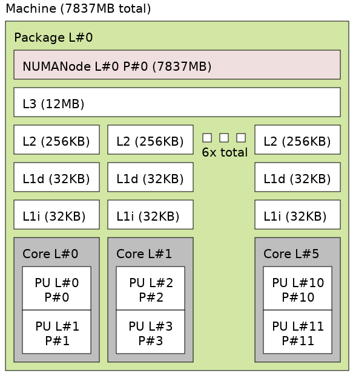
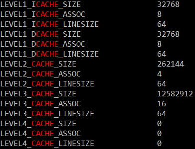

# Cache Memory Profiling
## System Research
Using the hwloc Linux tool, I can reveal the cache structure shown below:

  

From this, we can see that each core in my computer has its own L1 and L2 cache.  Further information, such as associativity, can be gathered from running "getconf -a | grep CACHE".

  

## Assignment #1: Read/Write Latency with Queue Length = 0
### Cache

### Main Memory
