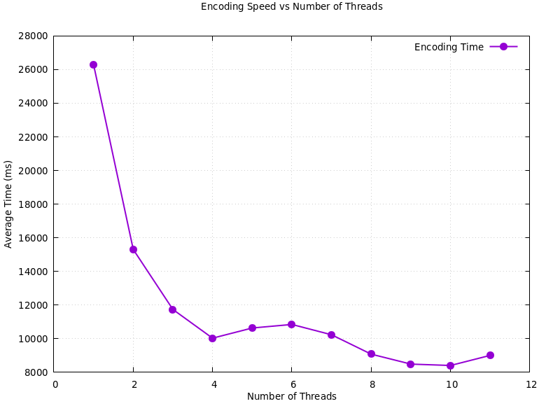
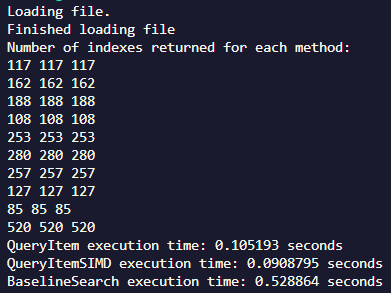
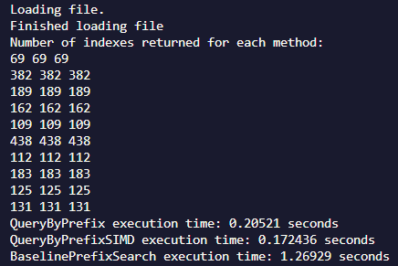

## Dictionary Codec Project

## Table of Contents
- [Dictionary Codec Project](#dictionary-codec-project)
- [Table of Contents](#table-of-contents)
- [Project Highlights](#project-highlights)
- [Overview](#overview)
- [Features](#features)
  - [1. Dictionary Encoding](#1-dictionary-encoding)
  - [2. Search Operations](#2-search-operations)
  - [3. Prefix Matching](#3-prefix-matching)
- [Performance Analysis](#performance-analysis)
  - [Encoding Speed Performance](#encoding-speed-performance)
  - [Results:](#results)
  - [Single Item Search Performance](#single-item-search-performance)
  - [Results:](#results-1)
  - [Prefix Scanning Performance](#prefix-scanning-performance)
  - [Results:](#results-2)
- [Usage](#usage)
  - [Command Line Interface](#command-line-interface)
  - [File Formats](#file-formats)
    - [Input Column File](#input-column-file)
    - [Encoded Output File](#encoded-output-file)
- [Implementation Details](#implementation-details)
  - [Key Classes](#key-classes)
    - [DictionaryCodec](#dictionarycodec)
  - [Threading Model](#threading-model)
  - [SIMD Optimizations](#simd-optimizations)
  - [Performance Measurement](#performance-measurement)
- [Building and Running](#building-and-running)
  - [Prerequisites](#prerequisites)
  - [Build Instructions](#build-instructions)
  - [Running Tests](#running-tests)
- [Performance Optimization Details](#performance-optimization-details)
  - [SIMD Implementation](#simd-implementation)
  - [Thread Safety](#thread-safety)

## Project Highlights
- Reduced memory latency by 80% using dictionary encoding
- Deployed SIMD instructions to promote effective data processing
- Utilized multithreading for search/scan operations

## Overview

This project implements a dictionary encoding system with various optimizations for searching and prefix matching. It features:
- Multi-threaded dictionary building
- SIMD-optimized search operations
- Prefix matching capabilities
- Performance comparison frameworks

## Features

### 1. Dictionary Encoding
- Efficient dictionary-based compression
- Multi-threaded dictionary building
- Thread-safe operations with mutex protection
- Configurable thread count based on hardware

### 2. Search Operations
Three search implementation methods:
1. Baseline (unoptimized)
2. Dictionary-based
3. SIMD-optimized

### 3. Prefix Matching
Three prefix matching implementations:
1. Baseline scanning
2. Dictionary-assisted matching
3. SIMD-optimized prefix matching

## Performance Analysis

### Encoding Speed Performance
- Multi-threaded implementation
- Scales based on available hardware threads
- Performance metrics:
  - Measures encoding time across thread counts
  - Averages over multiple runs
  - Outputs timing data for visualization
- Generally, more threads is better, but there are diminishing returns

### Results:


### Single Item Search Performance
Comparison of three implementations:

1. **Vanilla Baseline**
   - Direct string comparison
   - Linear scanning
   - No optimizations

2. **Dictionary (No SIMD)**
   - Dictionary lookup optimization
   - Encoded value scanning
   - Thread-safe implementation

3. **Dictionary with SIMD**
   - AVX2 SIMD instructions
   - 4x64-bit parallel processing
   - Optimized comparison operations
  
### Results:
- All methods returned the same indexes
- SIMD execution helped speed up the query process
- Both versions of the dictionary query were faster than the baseline
  


### Prefix Scanning Performance
Comparison of three approaches:

1. **Vanilla Baseline**
   - Linear string prefix scanning
   - Direct comparison operations
   - No optimization

2. **Dictionary-based**
   - Dictionary-assisted prefix filtering
   - Two-phase matching
   - Optimized dictionary lookup

3. **SIMD-optimized**
   - AVX2 instructions for prefix matching
   - 32-byte SIMD operations
   - Parallel value scanning
  
### Results:
- All methods returned the same indexes
- SIMD execution helped speed up the query process
- Both versions of the dictionary prefix query were faster than the baseline



## Usage

### Command Line Interface

```bash
# Encode a column file
./DictionaryCodec write_encoding

# Query individual items
./DictionaryCodec query_items

# Query by prefix
./DictionaryCodec query_prefix

# Test encoding speed
./DictionaryCodec encoding_speed
```

### File Formats

#### Input Column File
- One data item per line
- Text format
- No size limit

#### Encoded Output File
Format:
```
<data_size>
<key1>
<data1>
<key2>
<data2>
...
```

## Implementation Details

### Key Classes

#### DictionaryCodec
Main class implementing the encoding and search functionality:
- Dictionary building
- Encoding operations
- Search operations
- SIMD optimizations

### Threading Model
- Mutex-protected dictionary access
- Shared locks for read operations
- Local dictionaries per thread during building
- Thread-safe merge operations

### SIMD Optimizations
- AVX2 instruction set
- 256-bit SIMD operations
- Parallel comparison operations
- Optimized for both search and prefix matching

### Performance Measurement
- High-resolution clock timing
- Multiple run averaging
- Thread scaling analysis
- Gnuplot integration for visualization

## Building and Running

### Prerequisites
- C++17 or later compiler
- AVX2 support
- Gnuplot (for performance visualization)

### Build Instructions
```bash
cd DictionaryCodec
make
```

### Running Tests
```bash
./DictionaryCodec encoding_speed  # Use the desired test
```

## Performance Optimization Details

### SIMD Implementation
- Uses `__m256i` vectors for 256-bit operations
- Key operations:
  - `_mm256_set1_epi64x`: Broadcast values
  - `_mm256_cmpeq_epi64`: Parallel comparison
  - `_mm256_movemask_epi8`: Result extraction

### Thread Safety
- `shared_mutex` for read/write operations
- Local dictionary building for reduced contention
- Thread-safe dictionary merging
- Lock-free read operations where possible