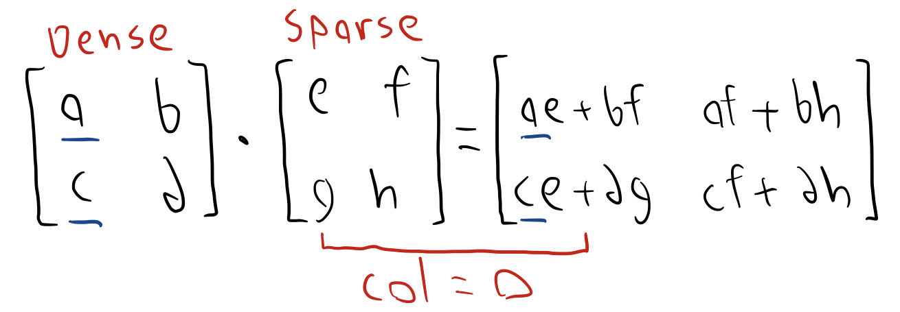

# Matrix Multiplication

## Overview
Sparse matrix multiplication involves multiplying matrices in which most elements are zero. Instead of storing and computing with all elements, sparse matrices only store and operate on the non-zero values, saving significant memory and computational resources. This technique is especially useful in industries where large, high-dimensional datasets are common but most of the data points are zero or insignificant.

In fields like machine learning, scientific computing, and graph analytics, sparse matrix multiplication is crucial for efficiency. It speeds up processes such as solving systems of equations, training machine learning models, and performing large-scale simulations, making it a cornerstone for high-performance computing. This optimization allows industries to handle massive datasets, like social network graphs or recommendation systems, more effectively, reducing computational costs and improving performance scalability.

This project will discuss an implementation of sparse matrices and methods such as multithreading, SIMD instructions, and effective caching that can help speed up the process. It will test these optimization methods on sparse-sparse, dense-sparse, and dense-dense matrix multiplication.

## Methodology
### Sparse Matrix Storage of Choice - LIL
TODO: Elaborate

### Sparse-Sparse Matrix Multiplication

### Dense-Sparse Matrix Multiplication
Since we store the corresponding column of each entry in the sparse matrix, we use the below figure to demonstrate how we can optimally perform the calculation. If we focus on the `e` index, we can see that it will be multiplied by all values in the matching column of the dense matrix. Additionally, we can see that these values are accumulated into the dense matrix row of the iten `e` is multiplied by.  Therefore, to perform dense-sparse multiplication, we can simply iterate through the sparse matrix, multiply by the appropriate value in each row of the same column of the dense matrix, and then add each result to the resulting matrix index. This is shown in the rough sketch below.

  

### Dense-Dense Matrix Multiplication

https://chryswoods.com/vector_c++/vectorisation.html

TODO: Make sure to run with size > cache

discuss openmps