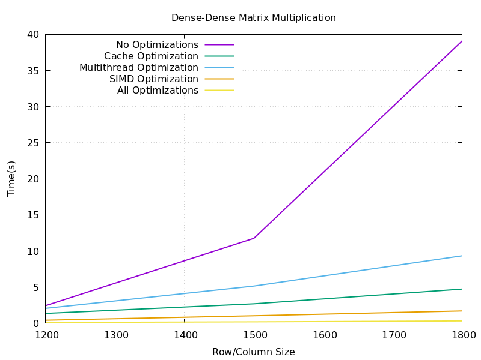
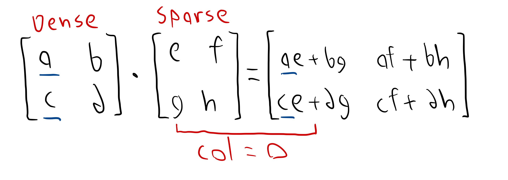

# Matrix Multiplication

## Project Highlights
1. Wrote Intel AVX2 SIMD instructions for manual data vectorization
2. Utilized OpenMP SIMD directives for automatic data vectorization
3. Built upon cache optimization knowledge gleaned from past projects
4. Created multithreaded versions of matrix multiplication
5. Combined the above strategies for maximum performance

## Overview
Sparse matrix multiplication involves multiplying matrices in which most elements are zero. Instead of storing and computing with all elements, sparse matrices only store and operate on the non-zero values, saving significant memory and computational resources. This technique is especially useful in industries where large, high-dimensional datasets are common but most of the data points are zero or insignificant.

In fields like machine learning, scientific computing, and graph analytics, sparse matrix multiplication is crucial for efficiency. It speeds up processes such as solving systems of equations, training machine learning models, and performing large-scale simulations, making it a cornerstone for high-performance computing. This optimization allows industries to handle massive datasets, like social network graphs or recommendation systems, more effectively, reducing computational costs and improving performance scalability.

This project will discuss an implementation of sparse matrices and methods such as multithreading, SIMD instructions, and effective caching that can help speed up the process. It will test these optimization methods on sparse-sparse, dense-sparse, and dense-dense matrix multiplication.

## LIL (List of Lists) Sparse Matrix Storage
I have chosen to use the List of Lists storage format for sparse matrices in this project. LIL represents a sparse matrix as an array of rows, where each row contains two lists: one for the column indices of non-zero elements and another for the corresponding values. This method is particularly efficient for row-wise access and modification.

For example, the matrix:

`[0]` `[5]` `[0]`\
`[1]` `[0]` `[0]`\
`[0]` `[0]` `[3]`

in LIL format would be stored as:
- Row 1: column indices `[1]`, values `[5]`
- Row 2: column indices `[0]`, values `[1]`
- Row 3: column indices `[2]`, values `[3]`.

LIL allows for dynamic updates, making it easy to incrementally build sparse matrices. However, it is inefficient for column access and requires additional memory to store the column indices alongside the non-zero values.

## Sparse-Sparse Matrix Multiplication
### Standard Implementation

1. **Input Matrices:**
   - Two sparse matrices `A` and `B` are provided. Both are in a row-centric format, where each row stores a list of non-zero elements along with their column indices. Additionally, the number of rows and columns for the result matrix is defined.

2. **Transpose Matrix `B`:**
   - Since matrix `B` is row-based, accessing its columns for multiplication would be inefficient. To address this, `B` is transposed, creating `B_transpose`. This transposed matrix stores columns of `B` as rows, making it easier to access columns during the multiplication step.

3. **Performing Matrix Multiplication:**
   - For each row in matrix `A`, the algorithm calculates the corresponding row in the result matrix:
     - It iterates over the non-zero elements of row `i` in `A`. For each non-zero element:
       - It identifies the corresponding row from `B_transpose`.
       - Then, it multiplies the non-zero element from `A` by the elements of the identified row in `B_transpose`.
       - The products are accumulated in a temporary result structure, where only the non-zero results are stored.

4. **Storing Results:**
   - Once a row multiplication is completed, the algorithm stores only the non-zero values in the corresponding row of the result matrix. This keeps the result matrix in sparse format and avoids unnecessary storage of zeros.

### Cache Optimization
#### I implemented `Loop Tiling` as it provides the following benefits:

1. **Minimizes Cache Misses**
   - **Spatial Locality**: Keeps data accessed together, improving cache hits.
   - **Temporal Locality**: Reuses data within tiles, reducing memory fetches.

2. **Increases Speed**
   - **Reduced Latency**: Faster access to data in cache compared to main memory.
   - **Improved Instruction-Level Parallelism**: Allows the compiler to better utilize flags such as -O2 or -O3.

3. **Enhances Multithreading Performance**
   - **Work Distribution**: Balances workloads across threads using separate tiles.
   - **Reduced False Sharing**: Aligns data access patterns to minimize conflicts.

**Benefits of Loop Tiling**

1. **Minimizes Cache Misses**
   - **Spatial Locality**: Keeps data accessed together, improving cache hits.
   - **Temporal Locality**: Reuses data within tiles, reducing memory fetches.
   - **Better Cache Utilization**: Optimizes memory access patterns based on cache size.

2. **Increases Speed**
   - **Reduced Latency**: Faster access to data in cache compared to main memory.
   - **Increased Throughput**: More data processed in less time due to optimized access.
   - **Improved Instruction-Level Parallelism**: Allows for better compiler optimizations.

3. **Enhances Multithreading Performance**
   - **Work Distribution**: Balances workloads across threads using separate tiles.
   - **Reduced False Sharing**: Aligns data access patterns to minimize conflicts.

4. **Adaptable to Hardware**
   - **Tailored to Cache Hierarchy**: Matches tile size to cache architecture for maximum performance.

### Multithreading Optimization
### SIMD Optimization
### All Optimizations

### Results and Analysis

  

Here, we see that the above optimization methods were extremely effective, with SIMD being the clear best. We can also see that for smaller matrices, multithreading may be less optimal than effective caching.

### Cache Optimization
### Multithreading Optimization
### SIMD Optimization
### All Optimizations

### Dense-Sparse Matrix Multiplication
Since we store the corresponding column of each entry in the sparse matrix, we use the below figure to demonstrate how we can optimally perform the calculation. If we focus on the `e` index, we can see that it will be multiplied by all values in the matching column of the dense matrix. Additionally, we can see that these values are accumulated into the dense matrix row of the iten `e` is multiplied by.  Therefore, to perform dense-sparse multiplication, we can simply iterate through the sparse matrix, multiply by the appropriate value in each row of the same column of the dense matrix, and then add each result to the resulting matrix index. This is shown in the rough sketch below.

  

### Dense-Dense Matrix Multiplication

https://chryswoods.com/vector_c++/vectorisation.html

TODO: Make sure to run with size > cache

discuss openmps

cache optimization;
Use vector instead of unordered_map for row_result
Pre-allocate memory for vectors
Use references to avoid unnecessary copying
Reduce cache misses by changing the loop order
Use local variables to reduce repeated access to vector elements