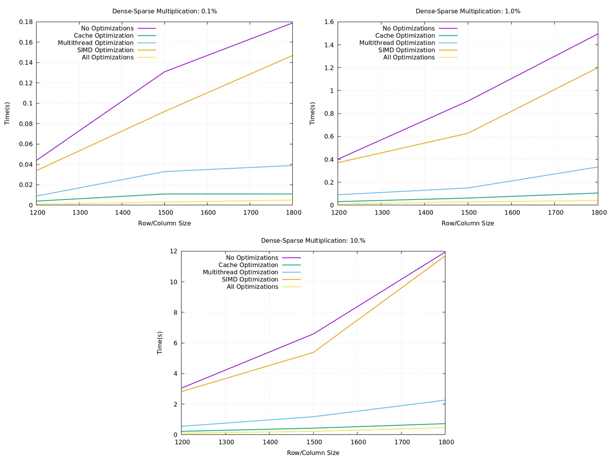

# Matrix Multiplication

## Project Highlights
1. Wrote Intel AVX2 SIMD instructions for manual data vectorization
2. Utilized OpenMP SIMD directives for automatic data vectorization
3. Built upon cache optimization knowledge gleaned from past projects
4. Created multithreaded versions of matrix multiplication
5. Combined the above strategies to perform matrix multiplication up to 100 times faster
6. Used gnuplot for plotting and data analysis

## Overview
Sparse matrix multiplication involves multiplying matrices in which most elements are zero. Instead of storing and computing with all elements, sparse matrices only store and operate on the non-zero values, saving significant memory and computational resources. This technique is especially useful in industries where large, high-dimensional datasets are common but most of the data points are zero or insignificant.

In fields like machine learning, scientific computing, and graph analytics, sparse matrix multiplication is crucial for efficiency. It speeds up processes such as solving systems of equations, training machine learning models, and performing large-scale simulations, making it a cornerstone for high-performance computing. This optimization allows industries to handle massive datasets, like social network graphs or recommendation systems, more effectively, reducing computational costs and improving performance scalability.

This project will discuss an implementation of sparse matrices and methods such as multithreading, SIMD instructions, and effective caching that can help speed up the process. It will test these optimization methods on sparse-sparse, dense-sparse, and dense-dense matrix multiplication.

## LIL (List of Lists) Sparse Matrix Storage
I have chosen to use the List of Lists storage format for sparse matrices in this project. LIL represents a sparse matrix as an array of rows, where each row contains two lists: one for the column indices of non-zero elements and another for the corresponding values. This method is particularly efficient for row-wise access and modification.

For example, the matrix:

`[0]` `[5]` `[0]`\
`[1]` `[0]` `[0]`\
`[0]` `[0]` `[3]`

in LIL format would be stored as:
- Row 1: column indices `[1]`, values `[5]`
- Row 2: column indices `[0]`, values `[1]`
- Row 3: column indices `[2]`, values `[3]`.

LIL allows for dynamic updates, making it easy to incrementally build sparse matrices. However, it is inefficient for column access and requires additional memory to store the column indices alongside the non-zero values.

## Sparse-Sparse Matrix Multiplication
### Standard Implementation

1. **Input Matrices:**
   - Two sparse matrices `A` and `B` are provided. Both are in a row-centric format, where each row stores a list of non-zero elements along with their column indices. Additionally, the number of rows and columns for the result matrix is defined.

2. **Transpose Matrix `B`:**
   - Since matrix `B` is row-based, accessing its columns for multiplication would be inefficient. To address this, `B` is transposed, creating `B_transpose`. This transposed matrix stores columns of `B` as rows, making it easier to access columns during the multiplication step.

3. **Performing Matrix Multiplication:**
   - For each row in matrix `A`, the algorithm calculates the corresponding row in the result matrix:
     - It iterates over the non-zero elements of row `i` in `A`. For each non-zero element:
       - It identifies the corresponding row from `B_transpose`.
       - Then, it multiplies the non-zero element from `A` by the elements of the identified row in `B_transpose`.
       - The products are accumulated in a temporary result structure, where only the non-zero results are stored.

4. **Storing Results:**
   - Once a row multiplication is completed, the algorithm stores only the non-zero values in the corresponding row of the result matrix. This keeps the result matrix in sparse format and avoids unnecessary storage of zeros.

### Cache Optimization
#### I implemented *Loop Tiling* as it provides the following benefits:

1. **Minimizes Cache Misses**
   - **Spatial Locality**: Keeps data accessed together, improving cache hits.
   - **Temporal Locality**: Reuses data within tiles, reducing memory fetches.

2. **Increases Speed**
   - **Reduced Latency**: Faster access to data in cache compared to main memory.
   - **Improved Instruction-Level Parallelism**: Allows the compiler to better utilize flags such as -O2 or -O3.

3. **Enhances Multithreading Performance**
   - **Work Distribution**: Balances workloads across threads using separate tiles.
   - **Reduced False Sharing**: Aligns data access patterns to minimize conflicts.

### Multithreading Optimization
#### I utilized `std::thread` to divide the multiplication up into 12 parts, one for each thread support by my CPU.

### SIMD Optimization
#### I utilized AVX2 SIMD instructions in the following manner:
1. **Initialization**: 
   - The result matrix is initialized to zero with dimensions based on matrices \( A \) and \( B \).
   - A 256-bit SIMD register (`__m256i sum`) is initialized to accumulate results for the dot product.

2. **Loading Data**:
   - For each element in the result matrix, the function processes 8 integers (32-bit each) at a time:
     - **Load operation**: The elements from the current row of matrix \( A \) and the current column of matrix \( B \) are loaded into SIMD registers using `_mm256_loadu_si256`.

3. **Multiplication**:
   - The multiplication of the loaded vectors from \( A \) and \( B \) is performed using the `_mm256_mullo_epi32` function, which multiplies corresponding elements of the two vectors.

4. **Accumulation**:
   - The products are accumulated into the `sum` register using `_mm256_add_epi32`, allowing simultaneous addition of all 8 products.

5. **Horizontal Sum**:
   - After processing all elements for a given pair `(i, j)`, the contents of the `sum` register are stored into a temporary array.
   - A horizontal sum is then performed by manually adding the 8 elements in the temporary array to obtain the final result for the result matrix at position `result[i][j]`.

### All Optimizations
#### When combining all optimizations into one function, extreme care was taken to combine the strengths of loop tiling, multithreading, and AVX2 SIMD instructions without causing errors.

### Results and Analysis
1. **Setup**:
   - Sizes: `{3000, 4000, 5000}`
   - Sparsity Percentages: `{0.1%, 1%, 10%}`

2. **Results**:
   - The overhead required by the optimization methods is not justified for very small and sparse matrices.
   - SIMD is the most effective optimization method.
   - Using all methods completed the calculation up to 24 times faster.

  

## Dense-Sparse Matrix Multiplication
In our sparse matrix representation, we store the corresponding column for each entry. The process of dense-sparse multiplication can be optimized as follows:

- Focus on a specific index (e).
- Multiply the value at index e by all corresponding values in the matching column of the dense matrix.
- Accumulate these results into the dense matrix row associated with index e.

To perform the multiplication:
1. Iterate through the sparse matrix.
2. Multiply by the appropriate value in each row of the corresponding dense matrix column.
3. Add the results to the resulting matrix index.

The figure below has been provided as a guide.

  

### Similar Optimization Methods:
1. **Multithreading:** `std::thread`
2. **SIMD:** AVX2 Instructions

### Caching Optimization Improvements:
1. **Ordering:**: Substantial performance boosts can be gained by iterating first over the dense matrix, which exists sequentially in cache.
2. **Tiling**: Tiling works extremely well in tandem with this strategy, leading to dominant cache optimization performance.

### Results and Analysis
1. **Setup**:
   - Sizes: `{1200, 1500, 1800}`
   - Sparsity Percentages: `{0.1%, 1%, 10%}`
2. **Results**:
   - Due to the varying structures between the matrices, cache optimization is key.
   - This process was much harder to apply SIMD to, and therefore SIMD was much less effective.
   - Using all methods completed the calculation up to 33 times faster.

  

## Dense-Dense Matrix Multiplication

### Similar Optimization Methods:
1. **Cache:** Loop Tiling
2. **Multithreading:** `std::thread`
3. **SIMD:** AVX2 Instructions

### Combined Optimization Improvements
1. **OpenMP Multithreading:**: Cleaner, compiler-driven multithreading.
2. **OpenMP SIMD Directives**: Collapsed outermost loops of operation.
3. **AVX2 Instructions**: Used in tandem with OpenMP SIMD directives.

### Results and Analysis
1. **Setup**:
   - Sizes: `{1200, 1500, 1800}`
   - Sparsity Percentages: `{0.1%, 1%, 10%}`
2. **Results**:
   - Dropped time from 39 (no optimizations) seconds to 0.388 seconds (all optimizations) for a 99.5% reduction.
   - SIMD was by far the most productive optimization method, as fully dense matrices are comprised almost entirely of vectorizable data.
   - Using all methods completed the calculation up to 100 times faster.

  

## Experimental Setup
1. **Clone this repository**
2. **Use `make` to build**
3. **Configured flags**
   - `-pthread`: `std::thread`
   - `-fopenmp-simd`: OpenMP SIMD directives
   - `-fopenmp`: OpenMP SIMD directives
   - `-mavx2`: AVX2 SIMD instructions
4. **Run ./mult.exe after compiling**
5. **Example calls**
   - `./mult.exe dsp`: Runs dense-sparse multiplication
   - `./mult.exe spsp`: Runs sparse-sparse multiplication
   - `./mult.exe dd`: Runs dense-dense multiplication
   - `./mult.exe dsp 10`: Runs dense-sparse multiplication with 10 threads