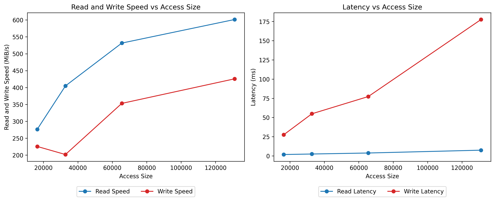

## SSD Profiling Project

## Table of Contents
- [SSD Profiling Project](#ssd-profiling-project)
- [Table of Contents](#table-of-contents)
- [Project Highlights](#project-highlights)
- [Overview](#overview)
- [FIO Tool Background](#fio-tool-background)
- [Key FIO Command Line Options for this Project](#key-fio-command-line-options-for-this-project)
- [Experiment 1: Impact of Data Access Size](#experiment-1-impact-of-data-access-size)
  - [FIO Configuration Overview](#fio-configuration-overview)
  - [Experimental Results](#experimental-results)
  - [Key Analysis](#key-analysis)
- [Experiment 2: Impact of Read/Write Intensity](#experiment-2-impact-of-readwrite-intensity)
  - [FIO Configuration Overview](#fio-configuration-overview-1)
  - [Experimental Results](#experimental-results-1)
  - [Key Analysis](#key-analysis-1)
- [Experiment 3: I/O Queue Length](#experiment-3-io-queue-length)
  - [FIO Configuration Overview](#fio-configuration-overview-2)
  - [Experimental Results](#experimental-results-2)
  - [Key Analysis](#key-analysis-2)
- [Comparison to D7-P5600 SSD](#comparison-to-d7-p5600-ssd)
  - [FIO Configuration Overview](#fio-configuration-overview-3)
  - [Comparison - Sequential Read](#comparison---sequential-read)
- [Getting Started](#getting-started)

## Project Highlights

- Optimized data access operations using access size and queueing length
- Developed Perl script for experiment orchestration
- Collected performance data using FIO tool
- Deployed Python script for graphing

## Overview
This project utilizes the FIO tool to test SSD latency and queue length. It will discuss the performance implications of data access size, read/write intensity, and I/O queue length. I will also attempt to maximize my SSD's performance and compare it to a standard server SSD.

## FIO Tool Background
FIO (Flexible I/O Tester) is a popular benchmarking tool used to measure and simulate I/O performance on storage devices and systems. It has the following key features: 
- **I/O Pattern Configuration**: Supports sequential, random, read, write, and mixed workloads.
- **Customizable**: Highly configurable with options for block size, I/O depth, threads, and more.
- **Cross-Platform Compatibility**: Available on Linux, Windows, WSL, and other systems.
- **Output**: Provides detailed performance metrics like throughput, latency, and IOPS.

For more details, visit the [FIO GitHub repository](https://github.com/axboe/fio).

## Key FIO Command Line Options for this Project
- **`--bs=<int>`**: Sets the block size for each I/O operation during testing.
- **`--rw=<operation>`**: Sets the read/write operation. Let operation = `randread` or `randwrite` for random testing.
- **`--iodepth=<int>`**: Sets the maximum number of requests that can be queued.
- **`--size=<int>`**: Sets the size limit. You can use `GiB`, `MiB`, or `KiB` instead of 1024^x.
- **`direct=1`**: Enforces direct access to SSD without caching.

## Experiment 1: Impact of Data Access Size
### FIO Configuration Overview
- **`--bs=<int>`**: Varied over the set `{16KiB, 32KiB, 64KiB, 128 KiB}`
- **`--iodepth=32`**: Specifies the number of I/O operations that can be in progress. This value has been chosen such that latency will not be impacted by an insufficient or excessive queue size.
- **`--size=2GiB`**: Limits reads/writes to 2 gigabytes.
- **`--runtime=3`+`--time_based`**: Runs each FIO execution for 3 seconds. This will read/write the file multiple times if appropriate.

### Experimental Results


### Key Analysis
1. Both read and write bandwidths are  **significantly increased** by increases to access size.
2. Higher access sizes create **bottlenecks** for the write operation, as seen by the data point which falls instead of dropping after an access size increase.
3. Write latency is **significantly increased** by increases in access size. This is because random writes to the **same location** cannot be parallelized.
4. Read latency is **barely impacted** by access size. This is because random reads to the **same location** do not conflict.
5. Both reads and writes have queue wait times **rise** when access size increases. This is because each operation encompasses **more** data and thus **takes longer**.
6. We expect that with **higher** access size, there will be a **lower** IOPS, as each operation will take longer.

## Experiment 2: Impact of Read/Write Intensity
### FIO Configuration Overview
- **`--bs=64KiB`**: Allows reasonable speed/latency impacts from block size so that read/write intensity's impact can be revealed.
- **`--iodepth=32`**: Specifies the number of I/O operations that can be in progress. This value has been chosen such that latency will not be impacted by an insufficient or excessive queue size.
- **`--size=1GiB`**: Limits reads/writes to 1 gigabyte.
- **`--runtime=3`+`--time_based`**: Runs each FIO execution for 3 seconds. This will read/write the file multiple times if appropriate.

### Experimental Results


### Key Analysis
1. A **higher** read percentage corresponds to a **higher** bandwidth due to the lack of write conflicts previously discussed.
2. Latency is also **drastically decreased** with increases to read percentage. With all other factors held the same, reads are simply faster. Therefore, each operation will be processed quicker, leading to **reduced** execution and queue waiting times.

## Experiment 3: I/O Queue Length
### FIO Configuration Overview
- **`--bs=64KiB`**: Allows reasonable speed/latency impacts from block size so that read/write intensity's impact can be revealed.
- **`--iodepth=<int>`**: Varied over the set `{1, 4, 16, 64, 256, 1024}`
- **`--size=1GiB`**: Limits reads/writes to 1 gigabyte.
- **`--runtime=3`+`--time_based`**: Runs each FIO execution for 3 seconds. This will read/write the file multiple times if appropriate.

### Experimental Results


### Key Analysis
1. Read speed/bandwidth is **highly improved** by increases to queue depth up to a point. This is because reads are completed fast enough to utilize the next operations.
2. At a certain point, read speed becomes **negatively impacted** by the queue depth. This is because although SSDs support multi-access, there is a limit. Eventually, adding additional reads will create a bottleneck.
3. Read speed is **negatively impacted** or **barely improved** by increases to queuing depth. This is because there will be performance decreases when more operations attempt to write to the same memory, although independent operations will increase bandwidth.
4. Again, latency also increases as we add more elements to the queue. This is because of the increase waiting time spent in the queue.

## Comparison to D7-P5600 SSD
### FIO Configuration Overview
- **`--rw=read`**: Reads allow maximum performance and sequential reads are even faster.
- **`--bs=16384KiB`**: Maximizes the amount of data submitted at once.
- **`--iodepth=128`**: Uses a higher queue capacity to feed constant data.
- **`--size=2GiB`**: Limits reads/writes to 2 gigabytes.
- **`--runtime=30`+`--time_based`**: Runs the experiment for 30 seconds.

### Comparison - Sequential Read
|     Drive     |  Bandwidth (MB/s) |
| ------------- | ----------------- |
| SSDPEKNW512G8 |      1814.31      |
|   D7-P5600    |      3500.00      |

As expected, the industry-standard SSD is much faster even with my optimizations. Further information on the D7-P5600 can be found [here](https://www.solidigm.com/products/data-center/d7/p5600.html).

## Getting Started

1. Clone this repository:
   ```
   git clone https://github.com/AshtonRopp/AdvancedComputerSystems.git
   cd SSD-Profiling
   ```
2. Install dependencies:
   - JSON (Perl)
   - Text::CSV (Perl)
   - Pandas (Python)
   - Matplotlib (Python)
3. Edit test.pl to suit the runtime environment:
   - Set `$write_path` and `$read_path` to the desired locations
   - Edit the line `system("python3 graph.py $graphCMD");` to use a Python version which has Matplotlib
4. Allocate read/write storage for the experiment:
   ```
   perl test.p1 setup
   ```
5. Run the executable:
   ```
   perl test.pl run [option] [number of runs (optional)]
   ```
   Options:
   - `data_access`: Test various data access sizes
   - `rw_cent`: Test various read read/write ratios
   - `queue_depth`: Test various queue depths
   - `max_performance`: Test max possible performance

   Example:
   ```
   ./perl test.pl run data_access
   ```
6. View the graphed data in plot.png
7. Remove SSD partitions after all testing is finished:
   ```
   perl test.pl clean
   ```
