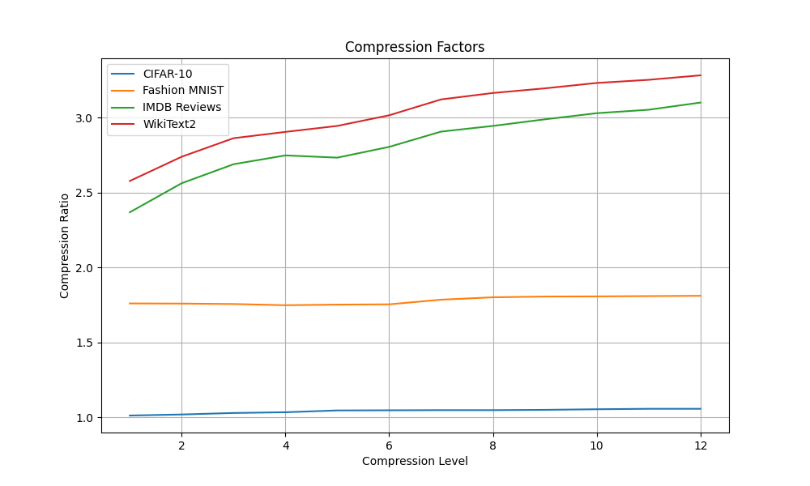
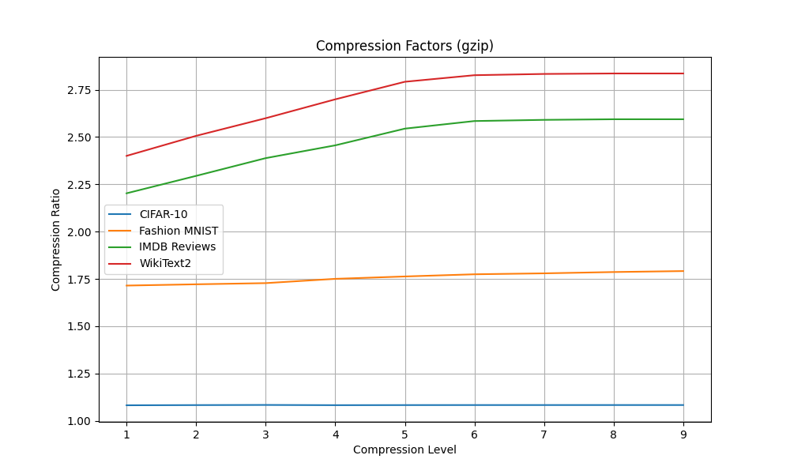
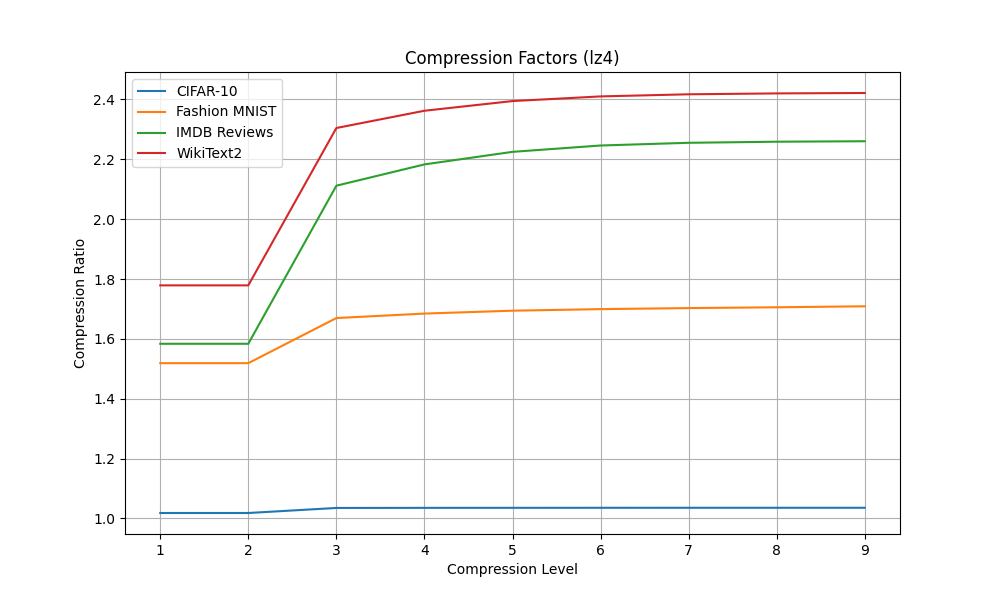
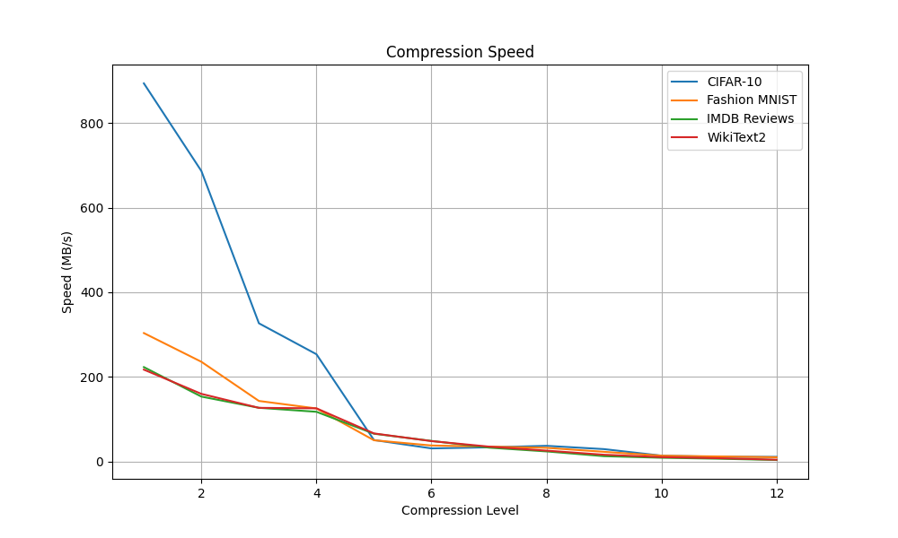
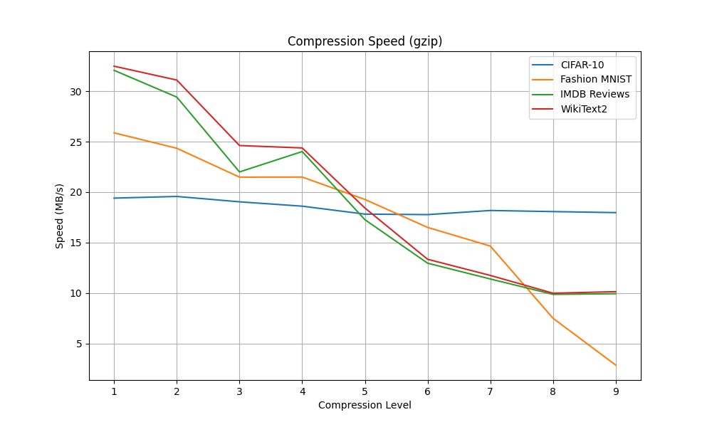
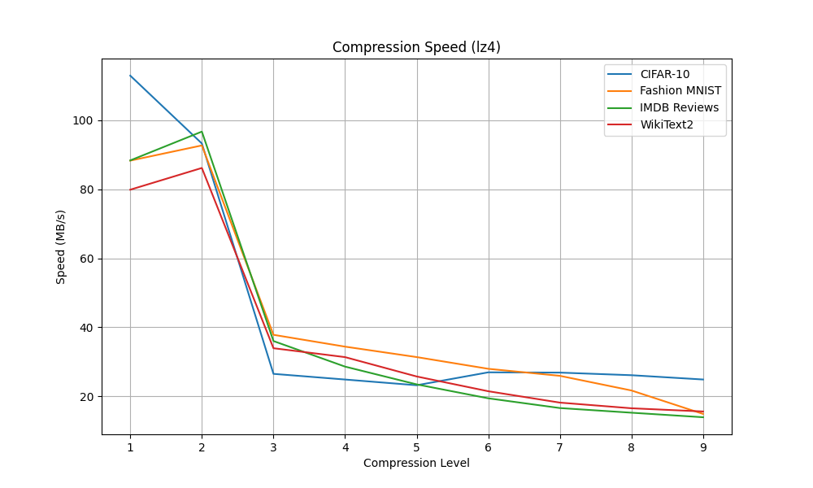
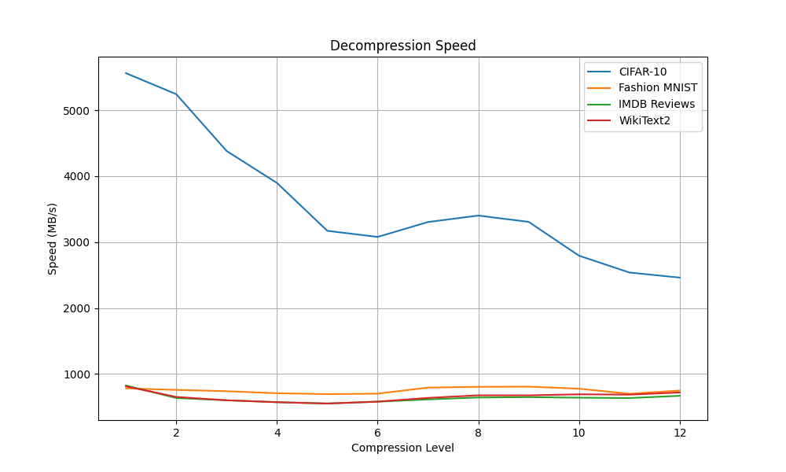
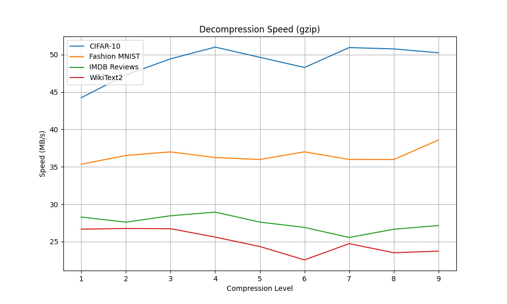
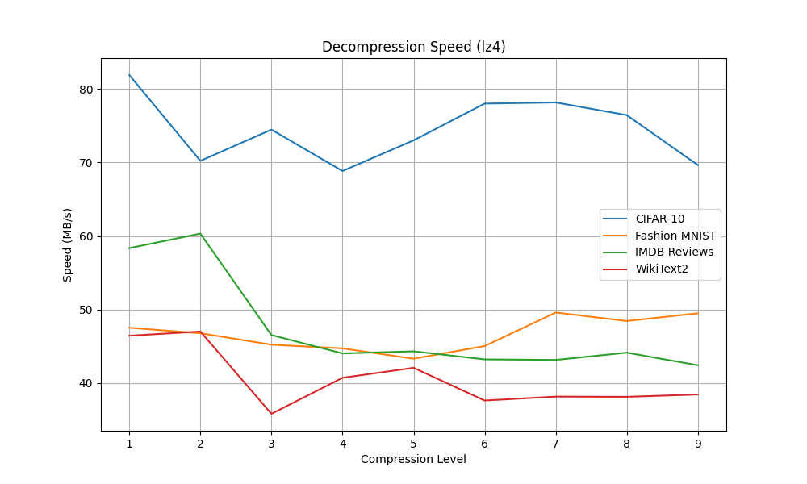
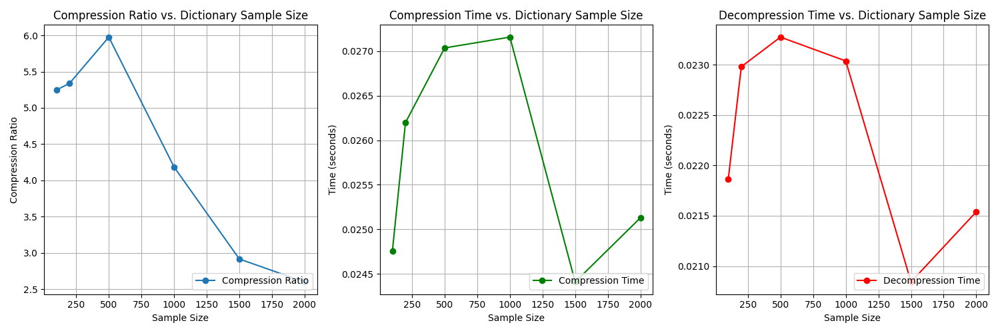

## Zstandard Compression Testing

## Table of Contents
- [Zstandard Compression Testing](#zstandard-compression-testing)
- [Table of Contents](#table-of-contents)
- [Project Info](#project-info)
- [Background Research](#background-research)
  - [Frames](#frames)
  - [Window\_Size](#window_size)
  - [Blocks](#blocks)
  - [Compression/Decompression](#compressiondecompression)
  - [Finite State Entropy Encoding (FSE)](#finite-state-entropy-encoding-fse)
- [Dataset Preparation Script](#dataset-preparation-script)
  - [Data Sets](#data-sets)
  - [Execution](#execution)
- [Basic Benchmarking Comparison](#basic-benchmarking-comparison)
  - [Compression Factor](#compression-factor)
  - [Compression Speed](#compression-speed)
  - [Decompression Speed](#decompression-speed)
- [Dictionary Training](#dictionary-training)
  - [Experiment](#experiment)
  - [Takeaways](#takeaways)
- [Resources](#resources)

## Project Info
This page is the coding portion of my final project of this course. I have chosen to research the Zstandard compression algorithm, as I will be working on this topic starting next semester for my master's project. Over that semester, I will be designing memory hardware that is optimized for Zstandard.

The other half of this assignment is a presentation. The presentation will discuss the following topics in further detail.

- Zstandard Algorithm Implementation
- Dictionary Training Implementation
- Zstandard Use Cases
- CLI Interface vs. Library Functionality

## Background Research
The following section will summarize my research into the Zstandard (zstd) algorithm. For more thorough documentation, refer to the project's compression format guide found [here](https://github.com/facebook/zstd/blob/dev/doc/zstd_compression_format.md).

### Frames
zstd compresses data into what is referred to as "frames". The format of these is shown below, taken from the Zstandard GitHub page.

| `Magic_Number` | `Frame_Header` |`Data_Block`| [More data blocks] | [`Content_Checksum`] |
|:--------------:|:--------------:|:----------:| ------------------ |:--------------------:|
|  4 bytes       |  2-14 bytes    |  n bytes   |                    |     0-4 bytes        |

- `Magic_Number`: Identifier which would be unlikely to start text file
- `Frame_Header`: Specifies frame attributes
- `Data_Block`: Data storage
- `Content_Checksum`: Error checking data

For a complete overview of frames, refer to [this](https://github.com/facebook/zstd/blob/dev/doc/zstd_compression_format.md#zstandard-frames) page.

### Window_Size
This is the minimum buffer size that the program will require for compression or decompression. 8 MB is the recommended max for this value. Generally, increasing `Window_Size` increases compression ratio but makes the process more memory intensive.

### Blocks
zstd stores data as "blocks". A block must include 3 bytes for its header. Block size is limited by `Block_Maximum_Size`, which is defined as the smaller value between `Window_Size` and 128 KB. Each frame has a set `Block_Maximum_Size`.

### Compression/Decompression
Compressed blocks contain a literals and sequences section. Literals can be stored regularly or compressed with Huffman prefixing. If using Huffman, there will be a tree included for decoding, or the previous dictionary will be used. The sequences section then consists of compressed references to the literals section.

To decompress these blocks, we must process both the literals and sequences sections.

### Finite State Entropy Encoding (FSE)
During my explanation, I omitted many symbols and specifiers for reader clarity. However, there are many pieces of data or tags we add to the compressed format for optimization purposes. One of the defining features of zstd is that it employs a second algorithm in addition to Huffman coding on the added tags. This format is FSE, which is described below.

1. **Build a Probability Model**:
   - Analyze input data to calculate symbol frequencies.
   - Normalize probabilities to fit a power-of-two space.

2. **Encoding**:
   - Use a finite-state machine (FSM) to encode symbols compactly.
   - Frequent symbols use fewer bits; rare symbols use more.
   - Output a tightly packed bitstream.

3. **Decoding**:
   - Start from the final encoding state.
   - Reverse the FSM process to reconstruct the original data.

An in-depth explanation of the algorithm can be found [here](https://github.com/facebook/zstd/blob/dev/doc/zstd_compression_format.md#fse).

## Dataset Preparation Script

This script uses the Hugging Face `datasets` library to download and process several machine learning datasets for various NLP and computer vision tasks.

### Data Sets
- IMDB Dataset: A collection of movie reviews designed for sentiment analysis tasks.
- WikiText-2 Dataset: A collection of Wikipedia articles frequently used for language modeling.
- CIFAR-10 Dataset: A dataset of 60,000 32x32 color images categorized into 10 classes, commonly used for image classification.
- Fashion-MNIST Dataset: A dataset of 28x28 grayscale images of clothing items, used for image classification tasks.

### Execution
```
python dataset_preparation.py
```

## Basic Benchmarking Comparison
For reference, I compared zstd to two other compression algorithms on the above data sets. The results are shown below. zstd dominated the other two algorithms in every category. I tested across various compression levels, for which a higher value encourages higher compression at the cost of speed.

### Compression Factor




### Compression Speed




### Decompression Speed




You can generate these plots by running the below commands.

```
python zstd_benchmark.py
python gzip_benchmark.py
python lz4_benchmark.py
```

## Dictionary Training
Another feature of zstd is that it allows you to "train" the algorithm by creating a dictionary for a specific type of data. Small, similar pieces of data can exploit this feature for higher compression ratios. This can be extremely useful for AI/ML models which use many small input files/data during training. To illustrate this, I wrote code to download the MNIST numbers images data set from Hugging Face and then ran the training algorithm on it. This data consists of small images of single digits. As a result, it has a small size and is highly repetitive, making it a prime use case for the dictionary training. This code can be ran as shown below.

### Experiment
```
python dictionaryTesting.py
```

This code runs the algorithm over various training data sizes. The results are shown below. We see that without the dictionary training, zstd's attempts to compress the files actually lead to a higher storage usage. However, if we use an optimal sample size, we can reduce storage down to 1/6 its original value. It is also important to note that training time increases exponentially with regards to training sample size, making it even more important to choose an optimal and small training sample size.

```
Downloading dataset...
Finished downloading.

Calculating standard compression metrics...

Standard Compression Metrics:
Original size: 313 bytes
Standard compressed size: 327 bytes
Time taken for standard compression: 0.0241 seconds
Time taken for standard decompression: 0.0178 seconds

Processing 100 samples...
Dictionary trained in 0.9595 seconds.

Processing 200 samples...
Dictionary trained in 1.8782 seconds.

Processing 500 samples...
Dictionary trained in 5.4713 seconds.

Processing 1000 samples...
Dictionary trained in 10.0070 seconds.

Processing 1500 samples...
Dictionary trained in 14.2405 seconds.

Processing 2000 samples...
Dictionary trained in 18.3947 seconds.
```

The script also outputs a graph, which is shown below. This graph shows that while we may see a speed increase by increasing the size of our dictionary, those gains will come at a cost to our compression ratio. This speed increase is also not guaranteed, as we see some variation along the graph. However, it should be noted that these speed results are still slower than using default zstd without dictionary training. We can confirm this by comparing the default output speeds printed above to their appropriate graphs below.



### Takeaways
- Pro: Dictionary training provides a higher compression rate
- Pro: Extremely small, repetitive data sets work even better
- Pro: More training data increases speed (up to a point)
- Con: More training data could decrease compression ratio
- Con: Utilizing dictionary training slightly increases latency
- Con: Dictionary costs additional overhead time to make

## Resources
- [zstd GitHub](https://github.com/facebook/zstd)
- [zstd CLI Guide](https://github.com/facebook/zstd/blob/dev/programs/zstd.1.md)
- [zstd Manual](https://raw.githack.com/facebook/zstd/release/doc/zstd_manual.html)
